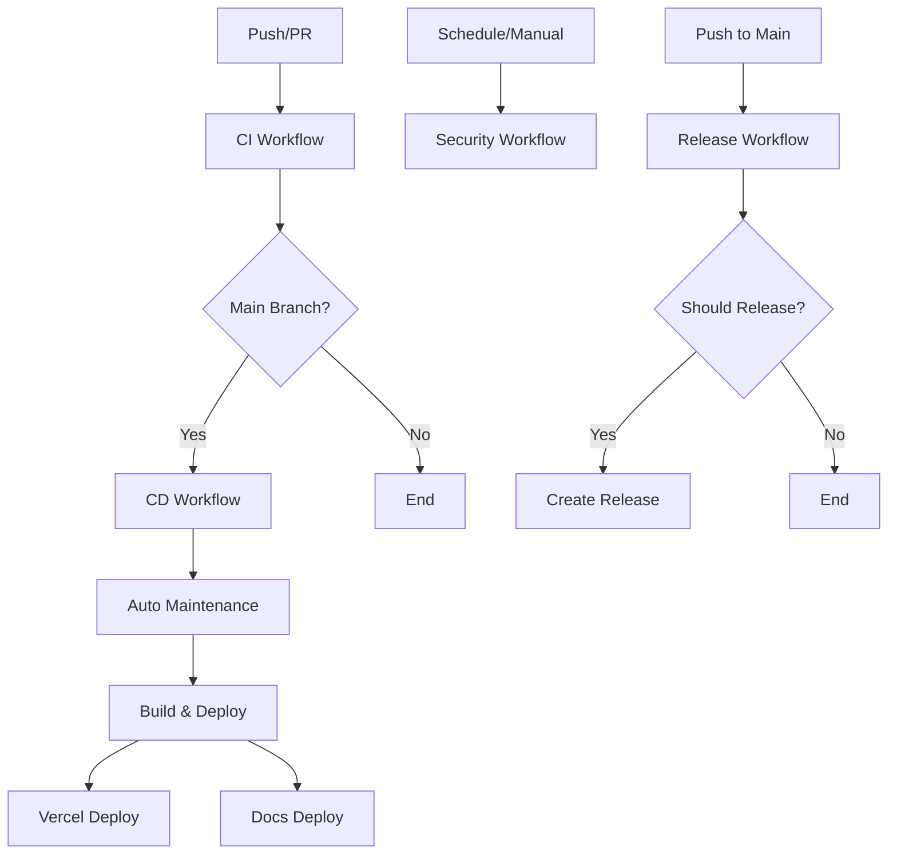

# 🚀 GitHub Actions Workflows

This document describes the GitHub Actions workflows in this repository.

## 📋 Workflow Overview

### 🧪 CI - Quality & Testing (`ci.yml`)

**Trigger:** Push to any branch, Pull requests to main/develop
**Purpose:** Continuous Integration - Code quality checks and testing

**Jobs:**

- **🔍 Code Quality:** Formatting, linting, commit message validation
- **🧪 Testing Matrix:** Tests across Node.js 18, 20, 22
- **🏗️ Build Verification:** Application and documentation builds
- **✅ CI Complete:** Final status aggregation

**Features:**

- Parallel execution for faster feedback
- Comprehensive test coverage reporting
- Artifact uploads for debugging
- Concurrency control to prevent resource conflicts

### 🚀 CD - Deploy & Release (`ci-cd.yml`)

**Trigger:** Push to main branch, successful CI completion
**Purpose:** Continuous Deployment - Automated deployments

**Jobs:**

- **🔧 Auto Maintenance:** Dependency updates and code fixes
- **🏗️ Build for Deployment:** Production-ready builds
- **🚀 Deploy to Vercel:** Application deployment
- **📚 Deploy Documentation:** GitHub Pages deployment
- **✅ Deployment Complete:** Status verification

**Features:**

- Auto-dependency updates with safety checks
- Multi-environment deployments
- Artifact management for deployment coordination
- Rollback-safe deployment strategy

### 🏷️ Release Management (`release.yml`)

**Trigger:** Push to main (filtered), Manual workflow dispatch
**Purpose:** Automated semantic versioning and releases

**Jobs:**

- **📋 Analyze Commits:** Smart commit analysis for release detection
- **🧪 Pre-release Testing:** Comprehensive validation before release
- **🏷️ Create Release:** Semantic version bump and GitHub release
- **📢 Post-release Actions:** Notifications and documentation updates

**Features:**

- Conventional commit parsing
- Automatic version bumping (patch/minor/major)
- CHANGELOG.md generation
- GitHub release creation with notes
- Manual release type override

### 🔒 Security & Dependencies (`security.yml`)

**Trigger:** Daily schedule (2 AM UTC), Manual dispatch, package.json changes
**Purpose:** Security monitoring and dependency management

**Jobs:**

- **🔍 Security Audit:** npm audit with vulnerability detection
- **🔄 Dependency Updates:** Check for available updates
- **🏗️ Build Verification:** Test builds with updated dependencies
- **🚨 Security Report:** Automated issue creation for security alerts

**Features:**

- Daily security scans
- Automated vulnerability reporting
- Safe dependency update verification
- Security issue tracking

## 🔧 Configuration Requirements

### Repository Secrets

For full functionality, configure these secrets in GitHub:

```bash
# Vercel Deployment
VERCEL_TOKEN=your_vercel_token
VERCEL_ORG_ID=your_vercel_org_id
VERCEL_PROJECT_ID=your_vercel_project_id

# Codecov (optional)
CODECOV_TOKEN=your_codecov_token
```

### Repository Settings

Enable these repository features:

1. **Actions:** GitHub Actions enabled
2. **Pages:** GitHub Pages enabled for documentation
3. **Environments:**
   - `production` environment for Vercel deployments
   - `github-pages` environment for documentation

### Branch Protection

Recommended branch protection rules for `main`:

- Require pull request reviews
- Require status checks (CI workflow)
- Require branches to be up to date
- Require conversation resolution before merging

## 📊 Workflow Dependencies



## 🎯 Best Practices

### Commit Messages

Use conventional commits for automatic release detection:

```bash
feat: add new feature (triggers minor release)
fix: resolve bug (triggers patch release)
feat!: breaking change (triggers major release)
docs: update documentation (no release)
chore: maintenance tasks (no release)
```

### Manual Overrides

- Add `[skip release]` to commit messages to prevent releases
- Add `[skip ci]` to skip CI workflows entirely
- Use workflow dispatch for manual releases with custom types

### Monitoring

- Check workflow status in the Actions tab
- Review security reports in Issues (automated)
- Monitor deployment status in Vercel dashboard
- Check documentation updates on GitHub Pages

## 🛠️ Troubleshooting

### Common Issues

1. **Failed Deployments:**
   - Check Vercel secrets are configured
   - Verify build artifacts are created correctly
   - Review deployment logs in workflow runs

2. **Failed Security Scans:**
   - Review npm audit output
   - Check for breaking changes in dependency updates
   - Manually run `npm audit fix` if needed

3. **Release Not Created:**
   - Ensure conventional commit format
   - Check commit message filters
   - Verify no `[skip release]` flags

4. **Test Failures:**
   - Review test logs in CI workflow
   - Check for environment-specific issues
   - Verify dependencies are correctly installed

### Debug Commands

```bash
# Local testing
npm run check          # Run all quality checks
npm run test:coverage  # Run tests with coverage
npm run build         # Test production build
npm run docs:build    # Test documentation build

# Dependency management
npm run update-deps:check  # Check for updates
npm run update-deps       # Update all dependencies
npm audit                 # Security audit
```

## 📝 Maintenance

The workflows are designed to be largely self-maintaining:

- Dependencies are automatically updated daily
- Code formatting and linting are auto-fixed
- Security vulnerabilities are automatically reported
- Documentation is automatically deployed

Regular manual review is recommended for:

- Security alerts and their resolutions
- Major dependency updates
- Workflow performance optimization
- Secret rotation and updates
